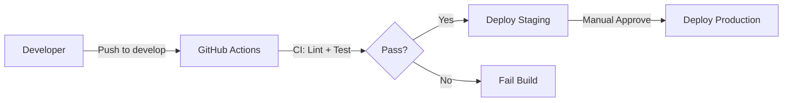

# Worship+ — Estrutura de Repositórios

**Versão:** 1.0  
**Data:** 2 de Março de 2026  
**Organização:** [worshipplus](https://github.com/worshipplus)

---

## Visão Geral

O projeto Worship+ é organizado em **7 repositórios** dentro da organização GitHub `worshipplus`, cada um com responsabilidade específica para facilitar manutenção, escalabilidade e separação de concerns.

---

## 1. worship-plus (Documentação Compartilhada)

**URL:** https://github.com/worshipplus/worship-plus.git  
**Propósito:** Documentação centralizada e compartilhada entre todas as equipes

### Conteúdo

```
worship-plus/
├── README.md                          # Visão geral do projeto
├── REPOSITORY-STRUCTURE.md            # Este arquivo (estrutura de repos)
├── DDD-GUIDE.md                       # Domain-Driven Design guide
├── ARCHITECTURE-DECISIONS.md          # Decisões arquiteturais (SOLID, DI, etc.)
├── MVP-ROADMAP.md                     # Roadmap completo do MVP
├── AGENTS-GUIDE.md                    # Guia operacional para agents
├── RFC-0001-media-storage.md          # RFC: Estratégia de armazenamento
├── RFC-0002-project-overview.md       # RFC: Visão geral do projeto
├── PROJECT_ANALYSIS.md                # Análise técnica completa
├── TECHNICAL_SPECS.md                 # Especificações técnicas
├── project-details.md                 # Detalhes do projeto
├── brainstorm-insights.md             # Insights de brainstorming
└── tasks.md                           # Plano de reorganização
```

### Quem Usa

- Product Manager Agent
- Software Architecture Agent
- Frontend/Backend Developers
- Stakeholders e novos membros do time

### Branches

- `main` - Documentação estável e aprovada
- `drafts/*` - Rascunhos de RFCs e documentos

### Comandos

```bash
# Clone
git clone https://github.com/worshipplus/worship-plus.git

# Atualizar documentação
git pull origin main

# Criar novo RFC
git checkout -b drafts/RFC-0003-name
```

---

## 2. worship-plus-agents (Agentes de IA)

**URL:** https://github.com/worshipplus/worship-plus-agents.git  
**Propósito:** Configurações e contextos dos agentes de IA (GitHub Copilot, Cursor, etc.)

### Conteúdo

```
worship-plus-agents/
├── README.md                          # Propósito e uso dos agents
├── teleprompter-agent/
│   ├── AGENT.md                       # Definição do agent
│   ├── RULES.md                       # Regras de operação
│   └── SKILLS.md                      # Habilidades e contextos
├── worship+/
│   ├── frontend-developer-agent/
│   │   ├── AGENT.md
│   │   ├── RULES.md
│   │   ├── SKILLS.md
│   │   ├── COMPONENT_GUIDELINES.md
│   │   ├── decision_log.md
│   │   └── Design System/
│   ├── product-manager-agent/
│   │   ├── AGENT.md
│   │   ├── RULES.md
│   │   └── SKILLS.md
│   └── software-architecture-agent/
│       ├── AGENT.md
│       ├── RULES.md
│       └── SKILLS.md
└── .copilot-instructions.md           # Instruções globais
```

### Quem Usa

- Desenvolvedores (setup local de agents)
- CI/CD (contexto para automações)
- Novos agents sendo configurados

### Comandos

```bash
# Clone
git clone https://github.com/worshipplus/worship-plus-agents.git

# Copiar para workspace local
cp -r worship-plus-agents/.agents ~/meu-workspace/.agents

# Atualizar agent
cd worship-plus-agents
git add agents/worship+/frontend-developer-agent/AGENT.md
git commit -m "docs(frontend-agent): atualiza guidelines de componentes"
git push origin main
```

---

## 3. worship-plus-poc (Proofs of Concept)

**URL:** https://github.com/worshipplus/worship-plus-poc.git  
**Propósito:** POCs e experimentos técnicos para validar arquitetura antes do MVP

### Conteúdo

```
worship-plus-poc/
├── README.md                          # Índice de POCs
├── poc-react-19-vite/                 # POC atual
│   ├── package.json
│   ├── vite.config.mjs
│   ├── src/
│   │   ├── components/
│   │   ├── views/
│   │   └── styles/
│   └── README.md
├── poc-supabase-realtime/             # Futuro: testes de realtime
└── poc-media-transcoding/             # Futuro: testes de ffmpeg
```

### Objetivo

- Validar React 19 + Vite antes do MVP ✅
- Testar Supabase Realtime subscriptions
- Provar viabilidade de transcodificação serverless
- Benchmark de performance

### Comandos

```bash
# Clone
git clone https://github.com/worshipplus/worship-plus-poc.git

# Rodar POC atual
cd worship-plus-poc/poc-react-19-vite
npm install
npm run dev

# Nova POC
mkdir poc-nome-experimento
cd poc-nome-experimento
npm init -y
```

---

## 4. worship-plus-frontend (Aplicação Web)

**URL:** https://github.com/worshipplus/worship-plus-frontend.git  
**Propósito:** Aplicação React 19 + Vite do Worship+ (produção)

### Conteúdo

```
worship-plus-frontend/
├── README.md
├── package.json
├── vite.config.js
├── .env.example
├── .github/
│   └── workflows/
│       ├── ci.yml                     # Lint, test, build
│       └── deploy.yml                 # Deploy Vercel/Netlify
├── src/
│   ├── features/                      # Feature-based modules
│   │   ├── auth/
│   │   ├── events/
│   │   ├── setlist/
│   │   ├── team/
│   │   └── availability/
│   ├── shared/                        # Compartilhado
│   │   ├── components/
│   │   ├── hooks/
│   │   ├── utils/
│   │   └── types/
│   ├── config/
│   │   ├── supabase.ts
│   │   └── container.ts               # Composition Root (DI)
│   ├── App.tsx
│   └── main.tsx
└── tests/
    ├── unit/
    ├── integration/
    └── e2e/
```

### Stack

- React 19 (Suspense, Transitions)
- Vite 6.0 (Build rápido)
- Supabase Client (Auth + DB)
- React Testing Library + Vitest
- CSS Modules ou Tailwind

### Comandos

```bash
# Clone
git clone https://github.com/worshipplus/worship-plus-frontend.git

# Setup
npm install
cp .env.example .env.local
# Adicionar VITE_SUPABASE_URL e VITE_SUPABASE_ANON_KEY

# Dev
npm run dev

# Build
npm run build

# Test
npm test
npm run test:e2e
```

### Deploy

- **Staging:** Vercel (auto-deploy em push para `develop`)
- **Production:** Vercel (auto-deploy em push para `main`)

---

## 5. worship-plus-backend (API/BFF)

**URL:** https://github.com/worshipplus/worship-plus-backend.git  
**Propósito:** Backend For Frontend (quando necessário - P2/P3)

### Conteúdo

```
worship-plus-backend/
├── README.md
├── package.json
├── .env.example
├── .github/
│   └── workflows/
│       ├── ci.yml
│       └── deploy.yml
├── src/
│   ├── domain/                        # DDD Entities
│   │   ├── events/
│   │   ├── team/
│   │   └── music/
│   ├── application/                   # Use Cases
│   │   ├── events/
│   │   ├── team/
│   │   └── music/
│   ├── infrastructure/                # Repositories, APIs
│   │   ├── database/
│   │   ├── storage/
│   │   └── messaging/
│   ├── presentation/                  # Controllers
│   │   ├── events/
│   │   ├── team/
│   │   └── music/
│   └── main.ts
└── tests/
```

### Stack

- NestJS (DI integrado, decorators)
- Supabase Client (backend)
- TypeORM ou Prisma (se necessário)
- Jest para testes

### Quando Usar

**Não usar no MVP (P0-P1)** → Frontend conecta direto no Supabase

**Usar em P2/P3 quando:**
- Múltiplos clientes (mobile app, web app)
- Orquestração de múltiplos serviços
- Regras de negócio complexas
- Cache Redis necessário

### Comandos

```bash
# Clone
git clone https://github.com/worshipplus/worship-plus-backend.git

# Setup
npm install
cp .env.example .env

# Dev
npm run dev

# Build
npm run build

# Deploy
npm run deploy:production
```

---

## 6. worship-plus-infra (Infraestrutura como Código)

**URL:** https://github.com/worshipplus/worship-plus-infra.git  
**Propósito:** IaC para provisionar recursos de cloud (S3, Kubernetes, RDS, etc.)

### Conteúdo

```
worship-plus-infra/
├── README.md
├── .github/
│   └── workflows/
│       └── terraform-apply.yml
├── terraform/                         # IaC principal
│   ├── environments/
│   │   ├── dev/
│   │   │   ├── main.tf
│   │   │   ├── variables.tf
│   │   │   └── terraform.tfvars
│   │   ├── staging/
│   │   └── production/
│   ├── modules/
│   │   ├── s3-media-storage/
│   │   │   ├── main.tf
│   │   │   ├── variables.tf
│   │   │   └── outputs.tf
│   │   ├── rds-postgres/
│   │   ├── cloudfront-cdn/
│   │   └── eks-cluster/
│   └── scripts/
│       └── init-state.sh
├── kubernetes/                        # K8s manifests
│   ├── base/
│   │   ├── deployment.yaml
│   │   ├── service.yaml
│   │   └── ingress.yaml
│   ├── overlays/
│   │   ├── dev/
│   │   ├── staging/
│   │   └── production/
│   └── helm/
├── ansible/                           # Config management (se necessário)
└── docs/
    ├── ARCHITECTURE.md
    └── RUNBOOK.md
```

### Stack

- **Terraform** 1.6+ (IaC)
- **Kubernetes** (EKS ou GKE)
- **Helm** (Package manager K8s)
- **GitHub Actions** (CI/CD infra)

### Recursos Provisionados

#### P0-P1 (MVP)
- ✅ Supabase (gerenciado - sem IaC necessário)
- ✅ Vercel/Netlify (frontend - gerenciado)

#### P1-P2 (Após MVP)
- 🔄 S3 Bucket (media storage)
- 🔄 S3 Glacier (archival)
- 🔄 CloudFront (CDN)
- 🔄 RDS Postgres (se migrar de Supabase)

#### P2-P3 (Escala)
- 🔄 EKS Cluster (Kubernetes)
- 🔄 Redis (cache)
- 🔄 SQS/SNS (messaging)
- 🔄 Lambda (serverless functions)

### Comandos

```bash
# Clone
git clone https://github.com/worshipplus/worship-plus-infra.git

# Setup Terraform
cd terraform/environments/dev
terraform init

# Plan
terraform plan

# Apply
terraform apply

# Destroy (cuidado!)
terraform destroy

# Deploy K8s (staging)
kubectl apply -k kubernetes/overlays/staging
```

### Inspiração

Baseado em: https://github.com/MatheusLimaGomes/dvn-workshop-jan-dia-1

---

## 7. worship-plus-scripts (Scripts Auxiliares)

**URL:** https://github.com/worshipplus/worship-plus-scripts.git (opcional)  
**Propósito:** Scripts de processamento de mídia e utilitários

### Conteúdo

```
worship-plus-scripts/
├── README.md
├── package.json
├── image-processor.js                 # Sharp para imagens
├── video-processor.js                 # ffmpeg para vídeo
├── palette-extractor.js               # Extração de cores
├── process-inspiration.js             # Pipeline de inspiração
└── io-utils.js                        # File operations
```

**Nota:** Pode ser integrado ao repo principal ou mantido separado conforme necessidade.

---

## Mapeamento de Conteúdo Atual

### Migração de `louvor-adpg` (workspace local)

| Conteúdo Atual | Repositório Destino | Ação |
|----------------|---------------------|------|
| `.agents/` | `worship-plus-agents` | ✅ Mover |
| `agents/` | `worship-plus-agents` | ✅ Mover |
| `DDD-GUIDE.md` | `worship-plus` | ✅ Já commitado |
| `ARCHITECTURE-DECISIONS.md` | `worship-plus` | ✅ Já commitado |
| `MVP-ROADMAP.md` | `worship-plus` | ✅ Já commitado |
| `AGENTS-GUIDE.md` | `worship-plus` | ✅ Já commitado |
| `RFC-*.md` | `worship-plus` | ✅ Já commitado |
| `PROJECT_ANALYSIS.md` | `worship-plus` | ✅ Já commitado |
| `TECHNICAL_SPECS.md` | `worship-plus` | ✅ Já commitado |
| `project-details.md` | `worship-plus` | ✅ Já commitado |
| `brainstorm-insights.md` | `worship-plus` | ✅ Já commitado |
| `tasks.md` | `worship-plus` | ✅ Já commitado |
| `poc/` | `worship-plus-poc` | ✅ Mover |
| `scripts/` | `worship-plus` (ou novo repo) | ✅ Já commitado |
| Código frontend futuro | `worship-plus-frontend` | 🔄 Criar novo |
| Código backend futuro | `worship-plus-backend` | 🔄 Criar novo |
| IaC futuro | `worship-plus-infra` | 🔄 Criar novo |

---

## Fluxo de Trabalho

### 1. Desenvolvimento de Feature

```bash
# Frontend
cd worship-plus-frontend
git checkout -b feature/US-007-event-creation
# ... desenvolver ...
git commit -m "feat(events): adiciona EventForm [US-007]"
git push origin feature/US-007-event-creation
# Criar PR para `develop`

# Atualizar documentação (se necessário)
cd ../worship-plus
git checkout -b docs/update-event-context
# ... atualizar DDD-GUIDE.md ...
git commit -m "docs(ddd): adiciona Event entity [US-007]"
git push origin docs/update-event-context
```

### 2. Deploy



### 3. Infra Change

```bash
cd worship-plus-infra
git checkout -b infra/add-s3-bucket

# Editar terraform/modules/s3-media-storage/main.tf
terraform plan

git commit -m "feat(infra): adiciona S3 bucket para media storage"
git push origin infra/add-s3-bucket

# PR → Review → Merge → GitHub Action aplica Terraform
```

---

## Estrutura de Branches

### Repos de Código (frontend, backend)

- `main` - Produção (protected)
- `develop` - Staging (protected)
- `feature/*` - Features em desenvolvimento
- `fix/*` - Bug fixes
- `hotfix/*` - Correções urgentes em produção

### Repos de Documentação (worship-plus, agents)

- `main` - Documentação estável
- `drafts/*` - Rascunhos e propostas

### Repos de Infra

- `main` - Produção (protected)
- `staging` - Staging
- `feature/*` - Mudanças de infra

---

## Permissões e Acesso

| Repositório | Visibilidade | Quem tem Acesso |
|-------------|--------------|-----------------|
| `worship-plus` | Public | Todos (leitura) / Core Team (escrita) |
| `worship-plus-agents` | Public | Todos (leitura) / Core Team (escrita) |
| `worship-plus-poc` | Public | Todos (leitura) / Core Team (escrita) |
| `worship-plus-frontend` | Private | Core Team |
| `worship-plus-backend` | Private | Core Team |
| `worship-plus-infra` | Private | DevOps Team |

---

## Comandos de Setup Inicial

### Criar Organização e Repos

```bash
# 1. Criar organização no GitHub
# https://github.com/organizations/worshipplus/repositories/new

# 2. Criar repos via GitHub CLI
gh repo create worshipplus/worship-plus --public --description "Worship+ Documentação Compartilhada"
gh repo create worshipplus/worship-plus-agents --public --description "Agents de IA (Copilot, Cursor)"
gh repo create worshipplus/worship-plus-poc --public --description "POCs e experimentos técnicos"
gh repo create worshipplus/worship-plus-frontend --private --description "Aplicação React + Vite"
gh repo create worshipplus/worship-plus-backend --private --description "API/BFF (NestJS)"
gh repo create worshipplus/worship-plus-infra --private --description "IaC (Terraform + Kubernetes)"

# 3. Configurar remotes
cd /Users/gomatheus/Desktop/louvor-adpg

# Adicionar novo remote para docs
git remote set-url origin git@github.com:worshipplus/worship-plus.git

# Ou adicionar paralelo
git remote add worshipplus-docs git@github.com:worshipplus/worship-plus.git
```

---

## Checklist de Migração

### Fase 1: Repositórios de Documentação ✅

- [x] Criar `worshipplus/worship-plus`
- [x] Migrar DDD-GUIDE, ARCHITECTURE-DECISIONS, MVP-ROADMAP
- [x] Atualizar README.md com propósito
- [ ] Criar `worshipplus/worship-plus-agents`
- [ ] Migrar `.agents/` e `agents/`
- [ ] Atualizar README.md com instruções
- [ ] Criar `worshipplus/worship-plus-poc`
- [ ] Migrar `poc/`
- [ ] Atualizar README.md com índice de POCs

### Fase 2: Repositórios de Código (MVP Sprint 1)

- [ ] Criar `worshipplus/worship-plus-frontend`
- [ ] Setup inicial: Vite + React 19
- [ ] Configurar CI/CD (GitHub Actions)
- [ ] Integrar Supabase
- [ ] README com instruções de setup

### Fase 3: Backend (P2 - Se necessário)

- [ ] Criar `worshipplus/worship-plus-backend`
- [ ] Setup NestJS
- [ ] Configurar DI e estrutura DDD
- [ ] README com decisões de quando usar

### Fase 4: Infraestrutura (P1-P2)

- [ ] Criar `worshipplus/worship-plus-infra`
- [ ] Setup Terraform
- [ ] Módulos: S3, CloudFront, RDS
- [ ] Kubernetes manifests (P2)
- [ ] README com runbook

---

## Referências

- **GitHub Organization:** https://github.com/worshipplus
- **Conventional Commits:** https://www.conventionalcommits.org/
- **Semantic Versioning:** https://semver.org/
- **Terraform Best Practices:** https://www.terraform-best-practices.com/
- **Inspiração Infra:** https://github.com/MatheusLimaGomes/dvn-workshop-jan-dia-1

---

**Este documento evolui conforme novos repositórios são criados.**

**Última atualização:** 2 de Março de 2026
