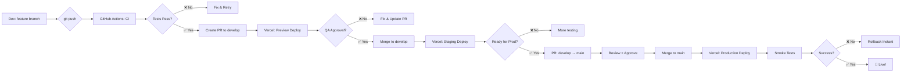

# 🚀 Plano de Deploy - Worship+ Frontend

**Versão:** 1.0.0  
**Data:** 2026-03-03  
**Objetivo:** Deploy contínuo com zero/baixo custo mantendo alta disponibilidade

---

## 📊 Comparativo de Plataformas

| Plataforma           | Custo Mensal | Performance | Limites Free Tier                      | Build Time | Recomendação         |
| -------------------- | ------------ | ----------- | -------------------------------------- | ---------- | -------------------- |
| **Vercel**           | $0 (Hobby)   | ⭐⭐⭐⭐⭐  | 100GB bandwidth, ilimitado projects    | ~30s       | ✅ **RECOMENDADO**   |
| **Netlify**          | $0 (Starter) | ⭐⭐⭐⭐⭐  | 100GB bandwidth, 300 build min/mês     | ~40s       | ✅ Alternativa forte |
| **GitHub Pages**     | $0           | ⭐⭐⭐      | 1GB storage, 100GB bandwidth/mês       | ~2min      | ⚠️ Sem SSR/API       |
| **Railway**          | $5/mês       | ⭐⭐⭐⭐    | $5 crédito grátis/mês                  | ~1min      | 💰 Pago após trial   |
| **Render**           | $0 (Free)    | ⭐⭐⭐      | 750h/mês, sleep após 15min inatividade | ~2min      | ⚠️ Cold start        |
| **Cloudflare Pages** | $0           | ⭐⭐⭐⭐⭐  | Ilimitado bandwidth, 500 builds/mês    | ~45s       | ✅ Ótima opção       |

---

## 🏆 Escolha Recomendada: **Vercel**

### Por que Vercel?

#### ✅ Vantagens

1. **Zero Configuração:** Deploy automático do GitHub
2. **Edge Network Global:** CDN em 40+ regiões (sub-100ms latency)
3. **Preview Deploys:** URL única para cada PR
4. **Analytics Grátis:** Core Web Vitals, performance insights
5. **Rollback Instantâneo:** Voltar para qualquer deploy anterior
6. **Custom Domains:** HTTPS automático (Let's Encrypt)
7. **Environment Variables:** Por branch (production, staging, development)
8. **Build Cache:** Builds incrementais (~10-30s)

#### 💰 Limites Free Tier (Hobby Plan)

- ✅ **Bandwidth:** 100GB/mês (suficiente para ~200k pageviews)
- ✅ **Builds:** Ilimitados
- ✅ **Projects:** Ilimitados
- ✅ **Team Members:** 1 (pode convidar colaboradores)
- ✅ **Deployments:** Ilimitados
- ✅ **Serverless Functions:** 100GB-Hours (12k invocações/dia)
- ⚠️ **Build Time:** 6h/dia (mais que suficiente)

#### 📈 Estimativa de Uso (MVP)

Assumindo 1000 usuários ativos/mês:

- **Bandwidth:** ~15GB/mês (15% do limite)
- **Builds:** ~50 builds/mês
- **Functions:** ~5k invocações/dia
- **Custo:** **$0/mês** ✅

---

## 🎯 Estratégia de Deploy Multi-Ambiente

### Ambientes

#### 1️⃣ **Development (Local)**

- **URL:** `http://localhost:5173`
- **Branch:** `feature/*`
- **Deploy:** Manual (npm run dev)
- **Dados:** Mock data + Supabase local
- **Hot reload:** Sim

#### 2️⃣ **Staging (Preview)**

- **URL:** `https://worship-plus-{pr-id}.vercel.app`
- **Branch:** `develop` ou PR para `main`
- **Deploy:** Automático via GitHub Actions
- **Dados:** Supabase Staging Database
- **Testes:** E2E automatizados

#### 3️⃣ **Production**

- **URL:** `https://worshipplus.app`
- **Branch:** `main`
- **Deploy:** Automático após merge + aprovação
- **Dados:** Supabase Production Database
- **Testes:** Smoke tests + Lighthouse CI

---

## 🔧 Configuração Vercel

### 1. Arquivo `vercel.json`

**Importante:** o app web fica em `frontend/`. O arquivo está em `frontend/vercel.json` e o _Root Directory_ do projeto na Vercel deve ser `frontend`.

```json
{
  "buildCommand": "npm run build",
  "devCommand": "npm run dev",
  "installCommand": "npm ci",
  "framework": "vite",
  "outputDirectory": "dist",
  "regions": ["gru1", "iad1"],
  "env": {
    "VITE_ENV": "production"
  },
  "build": {
    "env": {
      "VITE_SUPABASE_URL": "@supabase-url",
      "VITE_SUPABASE_ANON_KEY": "@supabase-anon-key"
    }
  },
  "headers": [
    {
      "source": "/(.*)",
      "headers": [
        {
          "key": "X-Content-Type-Options",
          "value": "nosniff"
        },
        {
          "key": "X-Frame-Options",
          "value": "DENY"
        },
        {
          "key": "X-XSS-Protection",
          "value": "1; mode=block"
        },
        {
          "key": "Referrer-Policy",
          "value": "strict-origin-when-cross-origin"
        }
      ]
    },
    {
      "source": "/assets/(.*)",
      "headers": [
        {
          "key": "Cache-Control",
          "value": "public, max-age=31536000, immutable"
        }
      ]
    }
  ],
  "redirects": [
    {
      "source": "/home",
      "destination": "/",
      "permanent": true
    }
  ],
  "rewrites": [
    {
      "source": "/(.*)",
      "destination": "/index.html"
    }
  ]
}
```

### 2. Environment Variables (Vercel Dashboard)

**Production:**

```env
VITE_SUPABASE_URL=https://xyz.supabase.co
VITE_SUPABASE_ANON_KEY=eyJhbGciOiJIUzI1NiIsInR5cCI6IkpXVCJ9...
VITE_ENV=production
VITE_API_BASE_URL=https://api.worshipplus.app
```

**Staging:**

```env
VITE_SUPABASE_URL=https://xyz-staging.supabase.co
VITE_SUPABASE_ANON_KEY=eyJhbGciOiJIUzI1NiIsInR5cCI6IkpXVCJ9...
VITE_ENV=staging
VITE_API_BASE_URL=https://api-staging.worshipplus.app
```

---

## 🔄 Workflow de Deploy

### Fluxo Completo



### Comandos

```bash
# 1. Desenvolver feature
git checkout -b feature/US-014-button-component
# ... código ...
git add .
git commit -m "feat(components): adiciona Button premium glassmorphism"
git push origin feature/US-014-button-component

# 2. Criar PR (GitHub UI ou CLI)
gh pr create --base develop --title "feat: Button component" --body "Implementa US-014"

# 3. Aguardar CI + Preview Deploy
# URL: https://worship-plus-pr-42.vercel.app

# 4. Após aprovação, merge to develop
gh pr merge 42

# 5. Staging deploy automático
# URL: https://worship-plus-staging.vercel.app

# 6. Quando pronto, PR develop → main
gh pr create --base main --title "release: Sprint 1" --body "Deploy US-013, 014, 016, 017"

# 7. Aprovação + merge → Production deploy automático
# URL: https://worshipplus.app
```

---

## 🎛️ Alternativas de Baixo Custo

### Opção 2: **Cloudflare Pages** (Backup)

**Vantagens:**

- Bandwidth ilimitado (mesmo no free tier)
- 500 builds/mês
- CDN global da Cloudflare
- Workers (serverless functions) integrado
- Custom domains ilimitados

**Desvantagens:**

- Configuração manual de redirects
- Analytics separado (Cloudflare Analytics)
- Menos integrado com GitHub

**Config:** `wrangler.toml`

```toml
name = "worship-plus"
compatibility_date = "2024-01-01"

[site]
bucket = "./dist"

[[redirects]]
from = "/*"
to = "/index.html"
status = 200
```

### Opção 3: **Netlify** (Alternativa)

**Vantagens:**

- Split testing (A/B tests) no free tier
- Form handling nativo
- Identity (auth) integrado
- Edge functions

**Desvantagens:**

- 300 build minutes/mês (pode acabar em projetos grandes)
- Build cache menos eficiente que Vercel

**Config:** `netlify.toml`

```toml
[build]
  command = "npm run build"
  publish = "dist"

[[redirects]]
  from = "/*"
  to = "/index.html"
  status = 200

[[headers]]
  for = "/assets/*"
  [headers.values]
    Cache-Control = "public, max-age=31536000, immutable"
```

### Opção 4: **GitHub Pages** (Fallback)

**⚠️ Limitações:**

- Apenas sites estáticos (sem API routes)
- Build manual (ou GitHub Actions)
- HTTPS apenas em domínios github.io

**Quando usar:** Apenas para demos/protótipos sem backend.

**Config:** GitHub Actions workflow

```yaml
name: Deploy to GitHub Pages

on:
  push:
    branches: [main]

jobs:
  deploy:
    runs-on: ubuntu-latest
    steps:
      - uses: actions/checkout@v4
      - uses: actions/setup-node@v4
        with:
          node-version: "20"
      - run: npm ci
      - run: npm run build
      - uses: peaceiris/actions-gh-pages@v3
        with:
          github_token: ${{ secrets.GITHUB_TOKEN }}
          publish_dir: ./dist
```

---

## 🌐 Configuração de Domínio Customizado

### Passos (Vercel)

1. **Comprar domínio:** Registro.br (~R$ 40/ano)
   - Domínio: `worshipplus.app`

2. **Adicionar domínio no Vercel:**

   ```bash
   vercel domains add worshipplus.app
   ```

3. **Configurar DNS:**

   ```
   Type: A
   Name: @
   Value: 76.76.21.21

   Type: CNAME
   Name: www
   Value: cname.vercel-dns.com
   ```

4. **Aguardar propagação:** 5-30 minutos
5. **HTTPS automático:** Vercel provisiona SSL (Let's Encrypt)

---

## 📊 Monitoramento e Analytics

### 1. Vercel Analytics (Grátis)

- Core Web Vitals (LCP, FID, CLS)
- Real User Monitoring
- Top pages, devices, locations

### 2. Google Analytics 4 (Grátis)

```tsx
// src/lib/analytics.ts
import ReactGA from "react-ga4";

export const initGA = () => {
  ReactGA.initialize("G-XXXXXXXXXX");
};

export const logPageView = (path: string) => {
  ReactGA.send({ hitType: "pageview", page: path });
};
```

### 3. Sentry (Error Tracking - Free Tier)

- 5k events/mês
- Source maps
- Release tracking

```tsx
// src/main.tsx
import * as Sentry from "@sentry/react";

Sentry.init({
  dsn: import.meta.env.VITE_SENTRY_DSN,
  environment: import.meta.env.VITE_ENV,
  tracesSampleRate: 0.1,
});
```

---

## 🚨 Plano de Rollback

### Cenários de Falha

1. **Build falha:** GitHub Actions bloqueia deploy
2. **Tests falham:** Deploy cancelado automaticamente
3. **Bug em produção:** Rollback manual instantâneo

### Rollback Manual (Vercel CLI)

```bash
# 1. Listar deploys
vercel list

# 2. Promover deploy anterior
vercel promote <deployment-url> --scope=worship-plus

# 3. Rollback em < 10 segundos
```

### Rollback via Dashboard

1. Acessar vercel.com/worship-plus/deployments
2. Clicar em deploy anterior
3. Botão "Promote to Production"
4. Confirmar

---

## 💰 Estimativa de Custos (Crescimento)

| Usuários/Mês | Pageviews | Bandwidth | Custo Vercel      | Custo Supabase | Total/Mês |
| ------------ | --------- | --------- | ----------------- | -------------- | --------- |
| 100          | 10k       | 5GB       | $0                | $0             | **$0**    |
| 1.000        | 100k      | 50GB      | $0                | $0             | **$0**    |
| 5.000        | 500k      | 250GB     | $20 (Pro)         | $25 (Pro)      | **$45**   |
| 10.000       | 1M        | 500GB     | $20               | $25            | **$45**   |
| 50.000       | 5M        | 2.5TB     | $150 (Enterprise) | $599 (Team)    | **$749**  |

**Resumo:**

- **0-1000 usuários:** 100% grátis ✅
- **1k-5k usuários:** $0-45/mês
- **5k+ usuários:** Considerar otimizações (CDN própria, cache)

---

## 🎯 Checklist de Deploy

### Pré-Deploy

- [ ] Testes passando (unit, integration, e2e)
- [ ] Lighthouse score > 90
- [ ] Bundle size < 500KB
- [ ] Environment variables configuradas
- [ ] Supabase policies validadas
- [ ] README atualizado
- [ ] CHANGELOG.md atualizado

### Post-Deploy

- [ ] Smoke tests em produção
- [ ] Verificar Core Web Vitals
- [ ] Testar auth flow completo
- [ ] Validar responsividade (mobile/desktop)
- [ ] Verificar logs (Vercel + Supabase)
- [ ] Notificar stakeholders

---

## 📚 Referências

- [Vercel Documentation](https://vercel.com/docs)
- [Cloudflare Pages Docs](https://developers.cloudflare.com/pages)
- [Netlify Docs](https://docs.netlify.com)
- [GitHub Actions CI/CD](https://docs.github.com/actions)

---

**Mantido por:** Architecture Agent + DevOps  
**Última atualização:** 2026-03-03  
**Próxima revisão:** Sprint 2 Review
