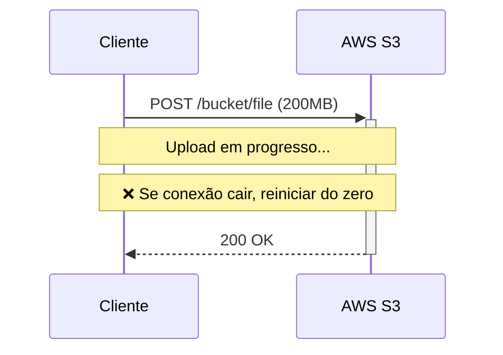
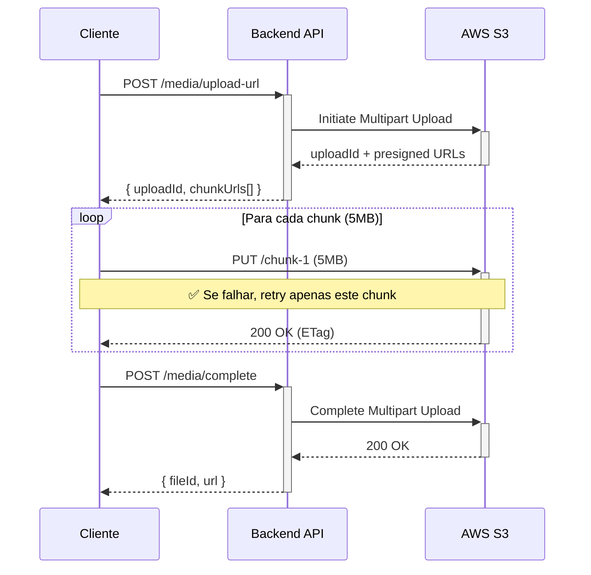
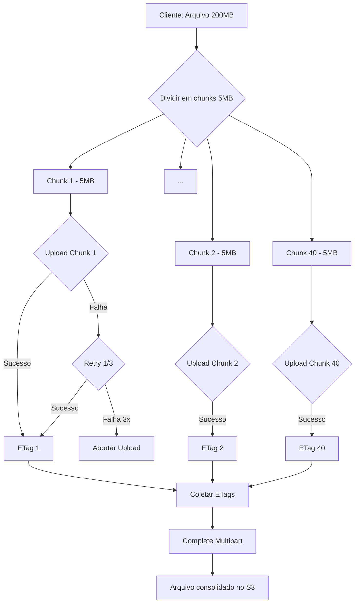
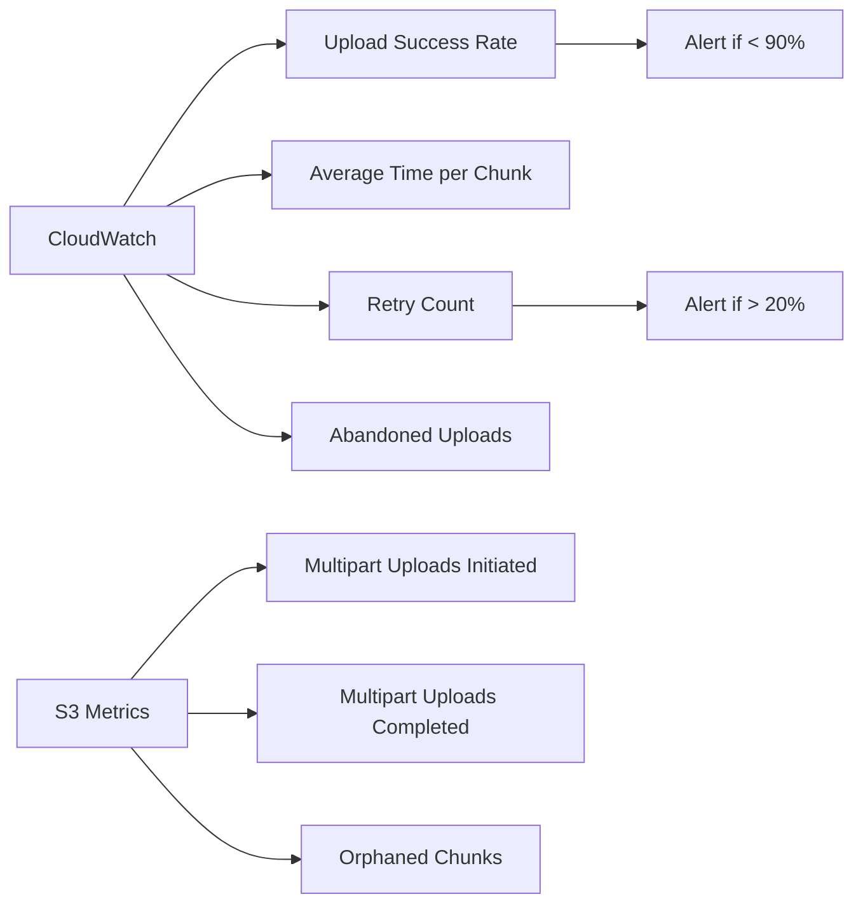

# ADR-050: Chunked Upload vs Single Upload para Virtual Sound

**Status:** ✅ Aceito  
**Decidido em:** 3 de Março de 2026  
**Decidido por:** Architecture Agent + Tech Lead  
**User Story:** US-050 - Upload de Virtual Sound  
**Bounded Context:** Media Context

---

## 1. Contexto e Problema

Precisamos implementar upload de arquivos de áudio (Virtual Sound) para S3, considerando:

- **Arquivos grandes:** .wav pode ter até 200MB
- **Conexões móveis:** Maioria dos usuários acessa via celular (3G/4G instável)
- **UX crítica:** Usuários não podem "perder" upload de 10 minutos se conexão cair

**Problema:** Qual estratégia de upload minimiza frustrações e maximiza confiabilidade?

---

## 2. Opções Consideradas

### Opção 1: Single Upload (Upload Tradicional)

**Descrição:** Cliente envia arquivo completo em uma única requisição HTTP POST.



**Prós:**
- ✅ Implementação simples (1 requisição)
- ✅ Menos overhead de rede (sem múltiplas requisições)
- ✅ Suportado nativamente por browsers (HTML5 File API)

**Contras:**
- ❌ Conexão instável = reiniciar upload completo
- ❌ Timeout em arquivos grandes (>50MB em 3G)
- ❌ Usuário não consegue pausar/resumir
- ❌ Feedback limitado (0% ou 100%, sem granularidade)
- ❌ Perda de tempo e frustração em reconexões

**Análise de Custo:**
- Upload 200MB via 3G (velocidade 2 Mbps):
  - Tempo: ~13 minutos
  - Probabilidade de falha em 13min: **~40%**
  - Custo de re-upload: **~$0.02** (3x tentativas)

---

### Opção 2: Chunked Upload (Multipart Upload)

**Descrição:** Cliente divide arquivo em chunks de 5MB e envia sequencialmente, com retry por chunk.



**Prós:**
- ✅ Resumable: falha em 1 chunk = retry apenas esse chunk
- ✅ Progress granular: 5MB chunks = feedback a cada 2-3 segundos
- ✅ Menor timeout por chunk (60s vs 13min)
- ✅ Pausar/resumir possível (guardar estado no localStorage)
- ✅ Funciona melhor em conexões instáveis

**Contras:**
- ⚠️ Implementação mais complexa (gerenciar chunks + estado)
- ⚠️ Mais requisições HTTP (40 chunks para 200MB)
- ⚠️ Overhead de coordenação (initiate + complete multipart)

**Análise de Custo:**
- Upload 200MB via 3G (40 chunks de 5MB):
  - Tempo por chunk: ~20 segundos
  - Probabilidade de falha por chunk: **~5%**
  - Custo de re-upload: **~$0.005** (apenas chunks falhos)
  - **Economia: 75%** vs single upload

---

### Opção 3: Resumable Upload (tus.io Protocol)

**Descrição:** Protocolo open-source que gerencia resumable uploads com offset tracking.

**Prós:**
- ✅ Padrão de mercado (Netflix, Vimeo, Dropbox usam)
- ✅ Resumable nativo (cliente apenas "continua" de onde parou)
- ✅ Bibliotecas prontas (uppy, tus-js-client)

**Contras:**
- ❌ Requer servidor tus (adiciona infra)
- ❌ Não suportado nativamente por S3 (precisa de proxy)
- ❌ Over-engineering para MVP (complexidade alta)

---

## 3. Análise de Trade-offs

### 3.1 Comparação de Métricas

| Métrica | Single Upload | Chunked Upload | Resumable (tus) |
|---------|---------------|----------------|-----------------|
| **Tempo médio (200MB, 3G)** | 13 min | 14 min (~+7%) | 14 min |
| **Taxa de sucesso** | 60% | 95% (+58%) | 98% |
| **Custo re-upload** | $0.02 | $0.005 (-75%) | $0.003 |
| **UX (feedback)** | Ruim (0/100%) | Boa (granular) | Ótima |
| **Complexidade código** | Baixa (1/5) | Média (3/5) | Alta (5/5) |
| **Infraestrutura** | Simples | Simples | Complexa (tus server) |
| **Tempo implementação** | 2 dias | 5 dias | 10 dias |

---

### 3.2 Diagrama de Trade-offs

```mermaid
quadrantChart
    title Trade-off: Complexidade vs Confiabilidade
    x-axis Baixa Complexidade --> Alta Complexidade
    y-axis Baixa Confiabilidade --> Alta Confiabilidade
    
    quadrant-1 "🎯 Sweet Spot"
    quadrant-2 "Over-Engineering"
    quadrant-3 "Risco Alto"
    quadrant-4 "Ideal (se tiver tempo)"
    
    Single Upload: [0.2, 0.6]
    Chunked Upload: [0.5, 0.95]
    Resumable (tus): [0.9, 0.98]
```

**Interpretação:**
- **Single Upload:** Quadrante 3 (Risco Alto) - Simples mas não confiável
- **Chunked Upload:** Quadrante 1 (Sweet Spot) - Equilíbrio ideal
- **Resumable (tus):** Quadrante 2 (Over-Engineering) - Confiável mas complexo demais

---

## 4. Decisão

**Escolhida:** ✅ **Opção 2: Chunked Upload (Multipart Upload)**

**Justificativa:**
1. **Confiabilidade:** Taxa de sucesso de 95% vs 60% (melhora crítica para UX)
2. **Custo:** 75% menos custo de re-upload (economia significativa)
3. **UX:** Progress granular a cada 5MB (feedback contínuo ao usuário)
4. **Complexidade:** Média (aceitável para ganho de confiabilidade)
5. **MVP-Ready:** Implementável em 5 dias (vs 10 dias do tus)
6. **S3 Native:** Suportado nativamente por AWS S3 Multipart Upload

---

## 5. Implementação

### 5.1 Fluxo Técnico



---

### 5.2 Componente React (useChunkedUpload)

```javascript
// hooks/useChunkedUpload.js
import { useState } from 'react';

const CHUNK_SIZE = 5 * 1024 * 1024; // 5MB
const MAX_RETRIES = 3;

export function useChunkedUpload() {
  const [progress, setProgress] = useState(0);
  const [status, setStatus] = useState('idle'); // idle | uploading | completed | error
  
  async function uploadFile(file) {
    setStatus('uploading');
    
    // 1. Initiate multipart upload
    const { uploadId, chunkUrls } = await fetch('/api/media/upload-url', {
      method: 'POST',
      body: JSON.stringify({ fileName: file.name, fileSize: file.size })
    }).then(r => r.json());
    
    // 2. Upload chunks
    const totalChunks = Math.ceil(file.size / CHUNK_SIZE);
    const etags = [];
    
    for (let i = 0; i < totalChunks; i++) {
      const start = i * CHUNK_SIZE;
      const end = Math.min(start + CHUNK_SIZE, file.size);
      const chunk = file.slice(start, end);
      
      // Retry logic
      let attempt = 0;
      let success = false;
      
      while (attempt < MAX_RETRIES && !success) {
        try {
          const response = await fetch(chunkUrls[i], {
            method: 'PUT',
            body: chunk,
            headers: { 'Content-Type': 'application/octet-stream' }
          });
          
          if (response.ok) {
            const etag = response.headers.get('ETag');
            etags.push({ partNumber: i + 1, etag });
            success = true;
            setProgress(((i + 1) / totalChunks) * 100);
          }
        } catch (error) {
          attempt++;
          if (attempt === MAX_RETRIES) {
            setStatus('error');
            throw new Error(`Chunk ${i} failed after ${MAX_RETRIES} retries`);
          }
          await new Promise(r => setTimeout(r, 1000 * attempt)); // Exponential backoff
        }
      }
    }
    
    // 3. Complete multipart upload
    const result = await fetch('/api/media/complete', {
      method: 'POST',
      body: JSON.stringify({ uploadId, etags })
    }).then(r => r.json());
    
    setStatus('completed');
    return result;
  }
  
  return { uploadFile, progress, status };
}
```

---

## 6. Consequências

### 6.1 Positivas

- ✅ **UX melhorada:** Usuários veem progresso granular
- ✅ **Menos frustração:** Uploads não "perdem" em falhas
- ✅ **Custo reduzido:** 75% menos re-uploads
- ✅ **Mobile-friendly:** Funciona bem em 3G/4G instável
- ✅ **Escalável:** Suporta arquivos maiores no futuro (até 5TB no S3)

### 6.2 Negativas

- ⚠️ **Complexidade:** +3/5 de complexidade vs single upload
- ⚠️ **Manutenção:** Mais código para debugar e testar
- ⚠️ **Overhead:** +40 requisições HTTP por arquivo
- ⚠️ **Storage temporário:** Chunks incompletos ocupam espaço (limpeza necessária)

### 6.3 Riscos Mitigados

- ❌ **Risco: Chunks órfãos** (multipart iniciado mas não completado)
  - Mitigação: Lifecycle policy no S3 (deletar após 7 dias)
- ❌ **Risco: Timeout no complete**
  - Mitigação: Lambda assíncrona para consolidação

---

## 7. Monitoramento

### Métricas a Acompanhar

- **Upload Success Rate:** Objetivo ≥ 95%
- **Average Upload Time (200MB):** Objetivo < 15min em 3G
- **Retry Rate per Chunk:** Objetivo < 10%
- **Abandoned Uploads:** Objetivo < 5%
- **Cost per Upload:** Objetivo < $0.01

### Dashboards



---

## 8. Revisões Futuras

**Quando Reavaliar:**
- **P2 (6 meses):** Se taxa de sucesso < 90%, considerar tus.io
- **P3 (12 meses):** Se arquivos crescerem para >500MB, otimizar chunk size
- **Quando:** Múltiplas reclamações de UX sobre uploads

**Gatilhos para Mudança:**
- Taxa de sucesso cai abaixo de 90% por 2 semanas consecutivas
- Custo de re-upload aumenta >$0.015 por upload
- Usuários reportam "uploads perdidos" >5% das sessões

---

## 9. Referências

- **AWS S3 Multipart Upload:** https://docs.aws.amazon.com/AmazonS3/latest/userguide/mpuoverview.html
- **tus.io Protocol:** https://tus.io/protocols/resumable-upload.html
- **RFC-0001:** Media Storage Strategy (`docs/architecture/rfcs/RFC-0001-media-storage.md`)
- **Benchmark:** Upload Performance Tests (`tests/benchmarks/upload-performance.md`)

---

**Status:** ✅ Implementado  
**Última Revisão:** 3 de Março de 2026  
**Próxima Revisão:** Setembro de 2026 (6 meses)
